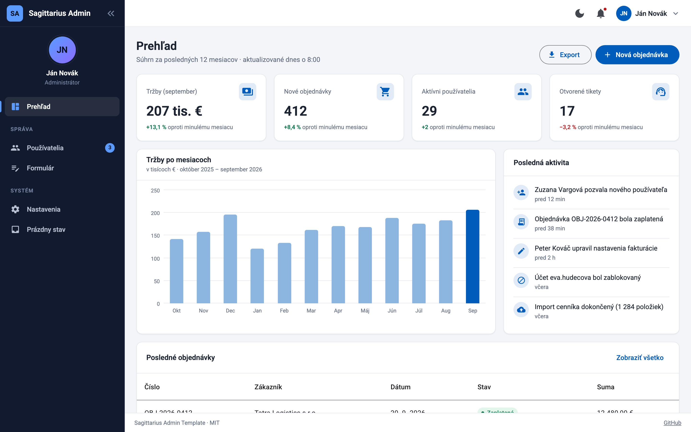
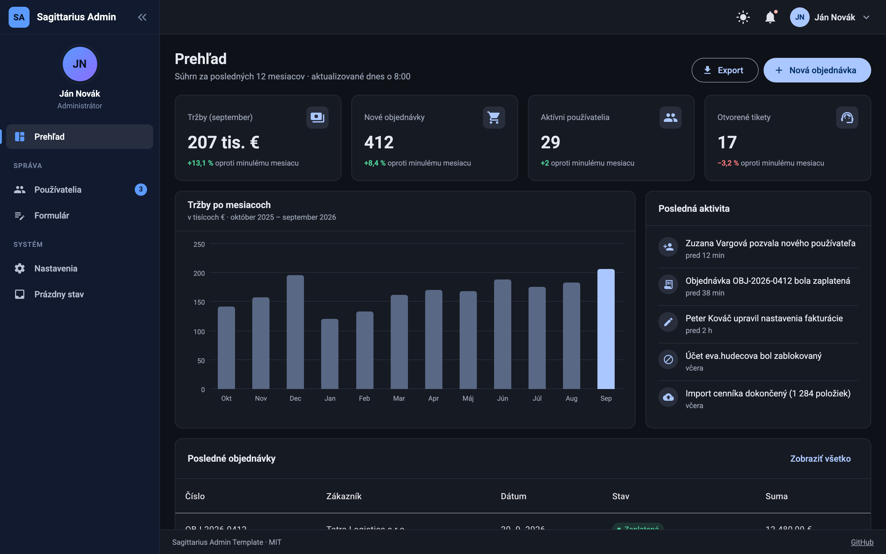
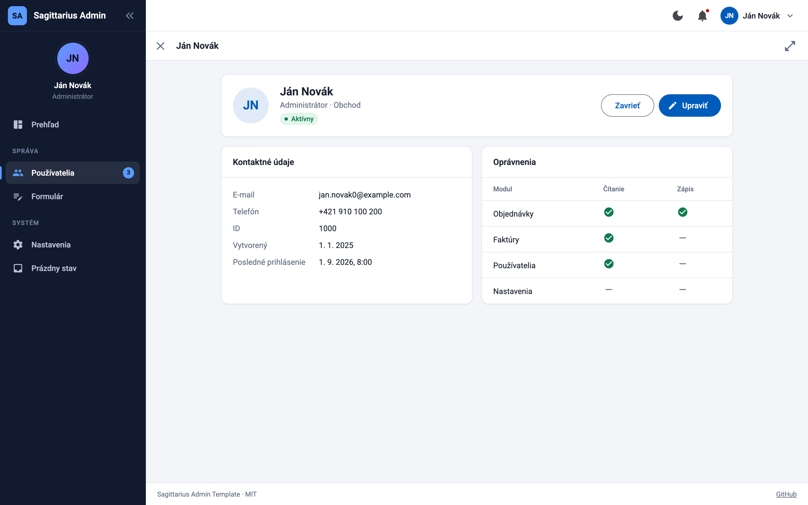
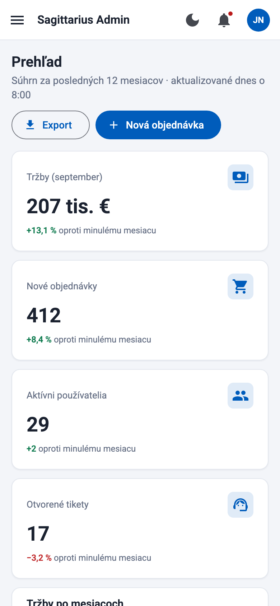

# Sagittarius Admin Template

[](https://github.com/majo32/sagittarius-admin-template/actions/workflows/ci.yml)
[](https://www.npmjs.com/package/sagittarius-admin-template)
[](LICENSE)

Admin application layout for **Angular 20 + Angular Material 3**. Drop one component into your app and get a collapsible sidebar, a header with a user menu, stacked drawers, a footer, light/dark theming and a set of CSS classes for building consistent pages.

**[▶ Live demo](https://majo32.github.io/sagittarius-admin-template/)** · **[npm package](https://www.npmjs.com/package/sagittarius-admin-template)** · **[Library docs](projects/sagittarius-admin-template/README.md)**

| Light | Dark |
|---|---|
|  |  |
|  |  |

## Features

- **Layout component** `<lib-sagittarius-admin>` – sidebar (260 px, collapses to 64 px and expands as an overlay on hover), sticky header, footer; full-screen overlay sidebar on mobile (< 800 px).
- **Stacked drawers** – `DrawerService.open(Component, inputs, options)` opens any component as a layer over the content. Layers nest (detail → edit), the browser Back button closes the top layer, and an optional link opens the same content as a full page.
- **Design tokens** – every color and size is a `--sg-*` CSS variable; light/dark via `light-dark()`; primary color follows your Angular Material theme.
- **Page utility classes** – `sg-page`, `sg-card`, `sg-grid`, `sg-stat`, `sg-badge`, `sg-toolbar`, `sg-form-grid`, `sg-kv`, `sg-empty-state`…
- **Modern Angular** – standalone components, signals, new control flow, strict templates. No dependencies besides Angular, CDK and Material.

## Quick start

```bash
npm i sagittarius-admin-template
```

```ts
import { SagittariusAdmin, SgMenuItem } from 'sagittarius-admin-template';

@Component({
  selector: 'app-root',
  imports: [RouterOutlet, SagittariusAdmin],
  template: `
    <lib-sagittarius-admin appTitle="My admin" [menuItems]="menu">
      <router-outlet />
    </lib-sagittarius-admin>
  `,
})
export class App {
  menu: SgMenuItem[] = [
    { label: 'Dashboard', icon: 'space_dashboard', route: '/dashboard' },
    { label: 'Users', icon: 'group', route: '/users' },
  ];
}
```

Add the stylesheet `node_modules/sagittarius-admin-template/styles/sagittarius-admin.scss` to `angular.json` → `styles`, and a Material theme. Full setup, inputs, slots, drawer API and theming: **[library README](projects/sagittarius-admin-template/README.md)**.

## Start with an AI assistant

Paste one of these prompts into an AI coding agent (Claude Code, Copilot, Cursor…) in an empty folder.

### Quickstart demo

Gives you a running admin app with sample pages to explore.

```text
Create a new Angular 20 application called "admin-demo" that uses the npm package
"sagittarius-admin-template" (Angular Material 3 admin layout). Follow the setup in
https://github.com/majo32/sagittarius-admin-template/blob/main/projects/sagittarius-admin-template/README.md
and use the demo app at https://github.com/majo32/sagittarius-admin-template/tree/main/projects/sagittarius-admin-template-example
as a reference.

1. Scaffold with `npx @angular/cli@20 new admin-demo --style=scss --routing --ssr=false`,
   then `ng add @angular/material` and `npm i sagittarius-admin-template`.
2. Setup: add `node_modules/sagittarius-admin-template/styles/sagittarius-admin.scss` before
   `src/styles.scss` in angular.json "styles"; add the Roboto and Material Icons links to index.html;
   define the Material theme in styles.scss with `mat.theme()` on `html` and `color-scheme: dark`
   on `html.dark-theme`.
3. In the root component wrap `<router-outlet />` in `<lib-sagittarius-admin>` with appTitle,
   menuItems (with a section header), a user and a user menu, a theme toggle button in the
   `sg-admin-header-actions` slot and a footer in the `sg-admin-footer` slot.
4. Add lazy-loaded pages with mock data:
   - Dashboard: 4 KPI tiles (`sg-card sg-stat`), a simple CSS bar chart, a recent orders table.
   - Users: mat-table with a filter toolbar (`sg-toolbar`), sorting and paging; clicking a row
     (`sg-table-clickable`) opens a detail via `DrawerService.open()`; the detail has an Edit button
     that opens a nested drawer with a reactive form that closes with `DrawerRef.close()`.
   - Settings: toggles and a light/dark theme switch (toggles the `dark-theme` class on <html>).
   - 404 page using `sg-empty-state`.
5. Build every page from the library CSS classes (`sg-page`, `sg-page-header`, `sg-card`,
   `sg-grid`, `sg-badge`, `sg-form-grid`, `sg-kv`, `sg-drawer-page`…) instead of custom layout CSS,
   and never hard-code colors – use the `--sg-*` CSS variables.
6. Use standalone components, signals (`input()`, `signal()`, `computed()`), `inject()` and the
   new control flow (`@if`, `@for`). Make sure `ng build` passes, then run `ng serve`.
```

### Clean starter for your own app

Gives you an empty, production-ready shell to build your frontend on.

```text
Create a new Angular 20 application called "my-admin" as a clean starting point for an admin
frontend built on the npm package "sagittarius-admin-template" (Angular Material 3 admin layout).
Follow the setup in
https://github.com/majo32/sagittarius-admin-template/blob/main/projects/sagittarius-admin-template/README.md.
Do NOT add demo pages or mock data.

1. Scaffold with `npx @angular/cli@20 new my-admin --style=scss --routing --ssr=false`,
   then `ng add @angular/material` and `npm i sagittarius-admin-template`.
2. Setup: add `node_modules/sagittarius-admin-template/styles/sagittarius-admin.scss` before
   `src/styles.scss` in angular.json "styles"; add the Roboto and Material Icons links to index.html;
   define the Material theme in styles.scss with `mat.theme()` on `html` and `color-scheme: dark`
   on `html.dark-theme`.
3. Root component: `<lib-sagittarius-admin>` with appTitle, `persistSidebarState`, menuItems kept in
   a separate `src/app/core/navigation.ts`, `<router-outlet />` as content and a theme toggle in
   the `sg-admin-header-actions` slot. Leave `user` as null with a TODO for wiring authentication.
4. Add `src/app/core/theme.service.ts` – a signal-based light/dark/system theme that toggles the
   `dark-theme` class on <html> and stores the choice in localStorage (inside try/catch).
5. Routing: lazy-loaded `home` page (empty `sg-page` with a `sg-page-header` and one `sg-card`
   placeholder), redirect '' -> 'home', and a `**` not-found page using `sg-empty-state`.
6. Folder structure: `src/app/core/` (services, navigation), `src/app/pages/<name>/` (one folder per
   page), `src/app/shared/` (reusable components).
7. Add an AGENTS.md describing the conventions for future work: build pages from the library CSS
   classes (`sg-page`, `sg-card`, `sg-grid`, `sg-toolbar`, `sg-form-grid`, `sg-kv`, `sg-drawer-page`…),
   use `--sg-*` CSS variables instead of hard-coded colors, open details/forms with `DrawerService`
   (inject `DrawerRef` with `{ optional: true }` in components that are also used as pages), new
   pages = folder in pages/ + lazy route + menu item, standalone components, signals, `inject()`,
   new control flow.
8. Make sure `ng build` passes with no errors.
```

## Repository structure

| Path | Description |
|---|---|
| [`projects/sagittarius-admin-template`](projects/sagittarius-admin-template) | The library (built with ng-packagr, published to npm). |
| [`projects/sagittarius-admin-template-example`](projects/sagittarius-admin-template-example) | Demo admin app – dashboard, table with drawer detail, forms, settings, empty states. Deployed to GitHub Pages. |

## Development

```bash
npm ci
npm run build:lib     # the demo imports the library from dist/, build it first
npm start             # demo on http://localhost:4200
npm run watch         # rebuild the library on change (run next to npm start)
npm run test:ci       # unit tests (headless Chrome)
```

See [CONTRIBUTING.md](CONTRIBUTING.md) for how to contribute and [SECURITY.md](SECURITY.md) for reporting vulnerabilities. Detailed guidelines for contributors and AI agents (layout contract, tokens, conventions) are in [AGENTS.md](AGENTS.md).

## Releasing

Releases are published to npm by GitHub Actions when a GitHub Release `vX.Y.Z` is created – see [PUBLIKOVANIE.md](PUBLIKOVANIE.md) and [CHANGELOG.md](CHANGELOG.md).

## License

[MIT](LICENSE) © Marian Spisiak
